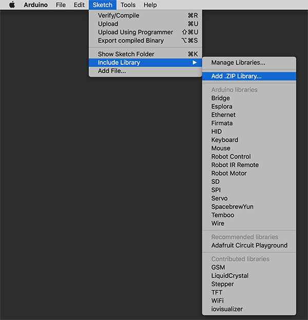

## 🎛 I/O Visualizer Arduino Library - [IO Visualizer Webpage](http://iovisualizer.com)

### Index
- [I/O Visualizer (Arduino Library)](iovisualizer/)
- [Examples (Arduino Code Examples for iovisualizer)](examples/)

### Tutorial
* [Official Tutorial Page](http://iovisualizer.com/docs.html)

### Quick Start Guide
* Download this repository
* Import [I/O Visualizer (Arduino Library)](iovisualizer/) to your Arduino Libraries - Sketch/Include Library/Add .ZIP Library...

* Select your arduino board under toolbar - Tools/Board
* Select your connection port under toolbar - Tools/Port
* Create a new sketch fill and use following example script

```
#include <iovisualizer.h>
iovisualizer iov;
 
void setup() {
  Serial.begin(9600);
  pinMode(5,OUTPUT);
}
 
void loop() {
  digitalWrite(5,HIGH);
  iov.dc1(200);
  iov.lcd("LED HIGH","DC SPEED 200");
  iov.probe(); //For visualizing the noise
  delay(500);
  digitalWrite(5,LOW);
  iov.dc1(10); //Motor1 speed 100, Motor2 Speed 200
  iov.lcd("LED LOW","DC SPEED 10");
  iov.probe(); //For visualizing the noise
  delay(500);
}
```

* Upload this sketch to your Arduino board
* Open IO Visualizer and type port information to the first textfield
  * Windows Example Port:
  * Mac Example Port: (/dev/cu.usbmodem1421) in IO Visualizer you just need to type 1421
* Type same frequency that you use in Arduino Script to the second textfield
* Connect and start prototyping.

⚠️ Note: You need to disconnect before uploading a new sketch file via Arduino Software

